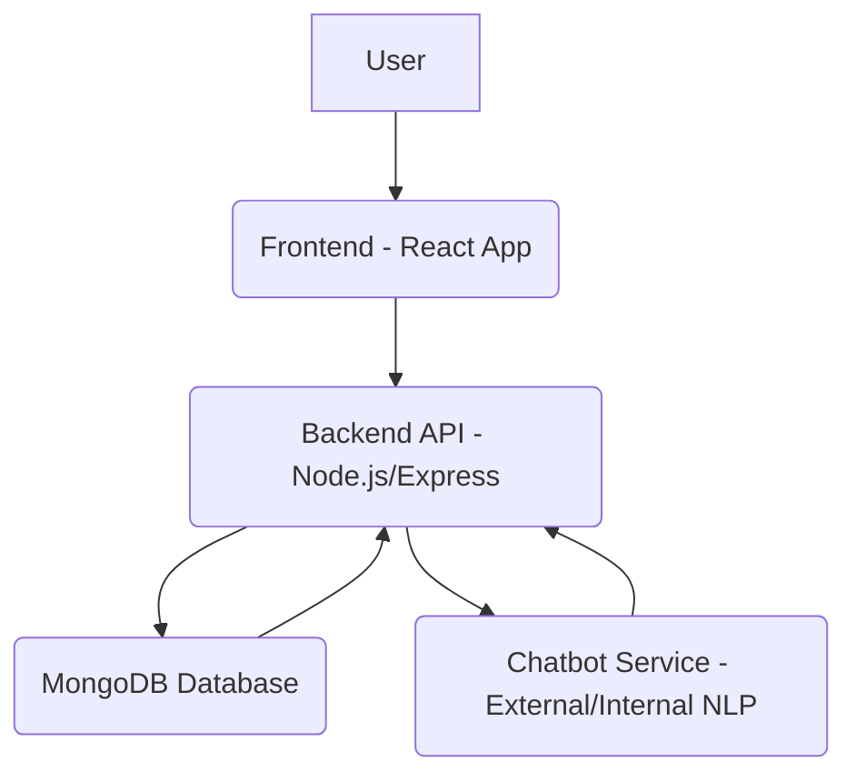

# System Overview: esaude-chatbot

## 1. Project Vision and Goals

The `esaude-chatbot` aims to provide an intelligent, interactive conversational agent for healthcare-related inquiries, offering reliable information and support to users. Our primary goals are:
*   To deliver accurate and up-to-date health information.
*   To provide a user-friendly and intuitive conversational interface.
*   To ensure data privacy and security for all user interactions.
*   To be scalable and adaptable to new features and integrations.

## 2. Overall System Architecture

The `esaude-chatbot` follows a client-server architecture, comprising a React-based frontend, a Node.js/Express backend API, and a MongoDB database. The system integrates with a specialized chatbot service for natural language processing and response generation.

## 3. Key Components and their Interactions

*   **Frontend (React App)**:
    *   User Interface for chat interactions.
    *   Handles user input and displays chatbot responses.
    *   Manages user authentication and session display.
    *   Communicates with the Backend API via RESTful calls.

*   **Backend API (Node.js/Express)**:
    *   Provides RESTful endpoints for frontend communication.
    *   Manages user authentication (login, signup).
    *   Handles chat session creation, message storage, and retrieval.
    *   Acts as an intermediary between the Frontend and the Chatbot Service.
    *   Manages evaluation data for chatbot responses.

*   **MongoDB Database**:
    *   Stores user data, chat sessions, individual messages, and evaluation feedback.
    *   Ensures persistence of conversational history and user profiles.

*   **Chatbot Service (External/Internal NLP)**:
    *   Processes natural language input from users.
    *   Generates relevant and accurate responses based on its knowledge base.
    *   Can be an external AI service or an internally developed NLP module.

## 4. Technology Stack Overview

*   **Frontend**: React.js, Redux (or Context API), Axios, Tailwind CSS
*   **Backend**: Node.js, Express.js, Mongoose (for MongoDB ORM), JWT (for authentication), bcrypt (for password hashing)
*   **Database**: MongoDB
*   **Chatbot Logic**: To be defined (e.g., Dialogflow, Rasa, custom NLP model)

## 5. High-level Data Flow

1.  User types a message in the Frontend.
2.  Frontend sends the message to the Backend API.
3.  Backend API forwards the message to the Chatbot Service.
4.  Chatbot Service processes the message and generates a response.
5.  Chatbot Service sends the response back to the Backend API.
6.  Backend API stores the message and response in MongoDB, then sends the response to the Frontend.
7.  Frontend displays the chatbot's response to the user.

## 6. Non-functional Requirements

*   **Performance**: Responses should be delivered within 2-3 seconds for typical queries.
*   **Security**: All user data and communications must be encrypted. Authentication and authorization mechanisms must be robust.
*   **Scalability**: The system should be able to handle a growing number of concurrent users and chat sessions.
*   **Usability**: The interface should be intuitive and easy to navigate for all users.
*   **Maintainability**: Codebase should be modular, well-documented, and follow best practices.

## 7. Glossary

*   **NLP**: Natural Language Processing
*   **API**: Application Programming Interface
*   **JWT**: JSON Web Token
*   **ORM**: Object-Relational Mapping
